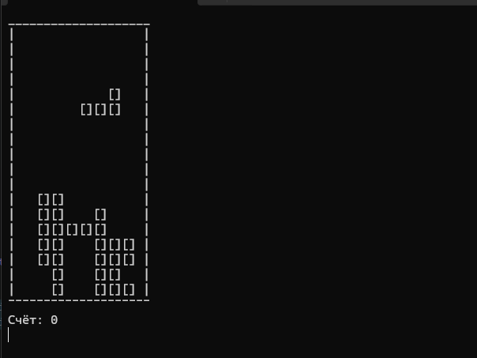
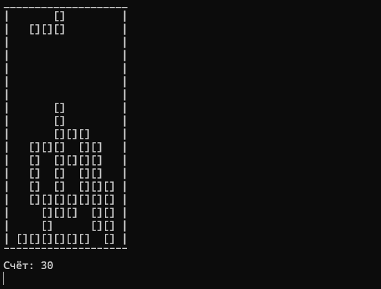
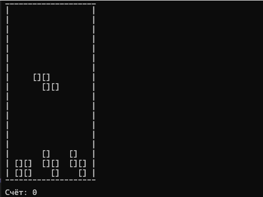

# Tetris Game (C++)

Classic Tetris game in C++, rendered in the terminal.

## Controls

- A — move left
- D — move right
- W — rotate
- Q — quit

## Features

- All 7 classic tetromino shapes (I, O, T, S, Z, J, L)
- Rotation with wall kick
- Collision detection
- Line clearing
- Score counting

## Getting Started

Requires Linux/macOS (or WSL on Windows) with `g++`.

```bash
g++ main.cpp -o tetris
./tetris
```

## Screenshot





## Author

[Welgy](https://github.com/Welgy)
